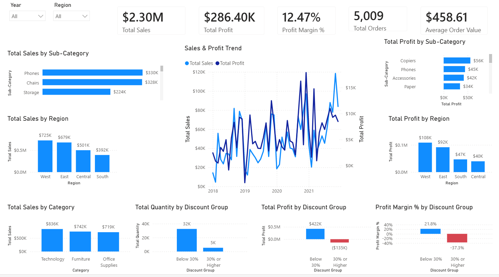
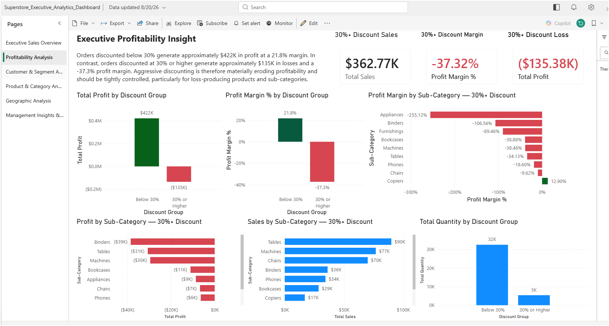
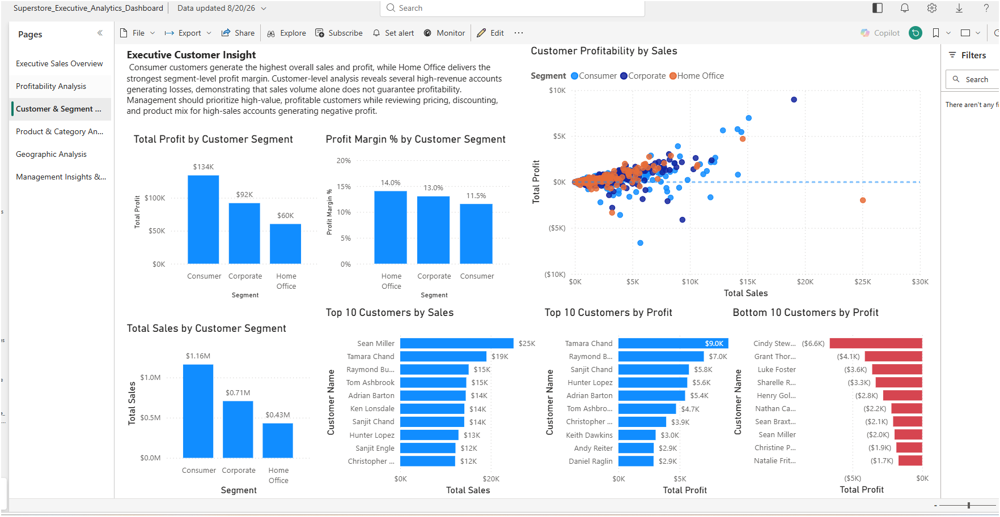
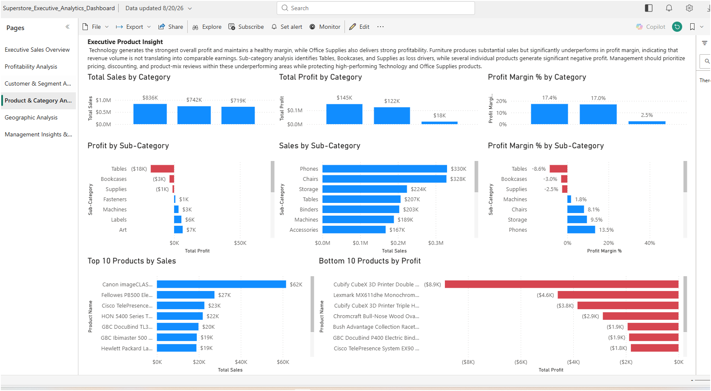
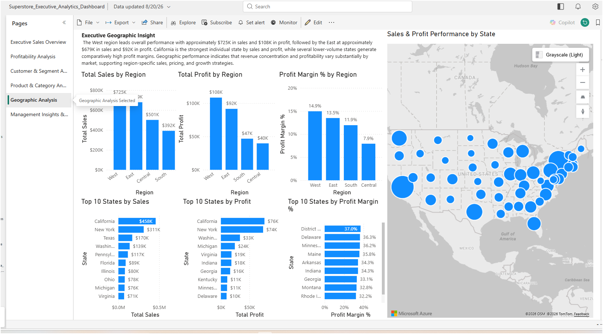
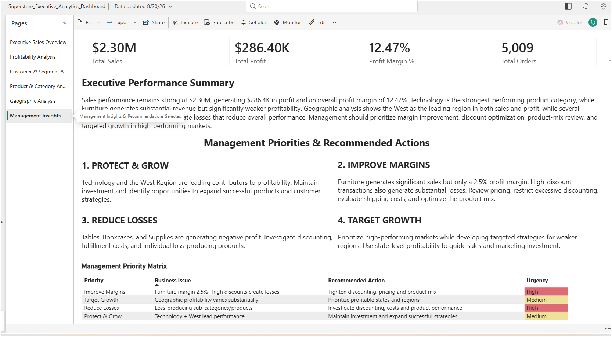

# Superstore Executive Analytics Dashboard

## Project Overview

This project is an executive-level Power BI analytics solution designed to transform Superstore transactional data into actionable business intelligence.

The dashboard evaluates sales performance, profitability, customer behavior, product performance, discount effectiveness, and geographic trends. The report was designed to help management identify growth opportunities, detect sources of profit erosion, and make data-driven strategic decisions.

## Executive KPIs

| KPI | Result |
|---|---:|
| Total Sales | $2.30M |
| Total Profit | $286.40K |
| Profit Margin | 12.47% |
| Total Orders | 5,009 |
| Average Order Value | $458.61 |

## Dashboard Pages

The Power BI report contains six analytical pages:

1. **Executive Sales Overview** — Enterprise-level KPIs, sales trends, regional performance, category performance, and discount analysis.
2. **Profitability Analysis** — Evaluation of profitability and the financial impact of high-discount transactions.
3. **Customer & Segment Analysis** — Customer segment performance, top customers, loss-producing customers, and sales-versus-profit relationships.
4. **Product & Category Analysis** — Category, sub-category, and individual product performance.
5. **Geographic Analysis** — Regional and state-level sales, profit, and profit-margin analysis.
6. **Management Insights & Recommendations** — Executive findings translated into prioritized management actions.

## Key Business Insights

- Technology is the strongest-performing product category.
- The West region leads overall sales and profitability.
- Furniture produces substantial revenue but operates at a significantly weaker profit margin.
- Transactions discounted below 30% generate strong profitability.
- Discounts of 30% or greater produce substantial losses and negative margins.
- Tables, Bookcases, and Supplies are loss-producing sub-categories.
- Sales volume alone does not guarantee customer or product profitability.
- Geographic profitability varies substantially across states and regions.

## Management Recommendations

Management should:

- Protect and expand high-performing Technology products and markets.
- Improve Furniture margins through pricing and product-mix optimization.
- Reduce excessive discounting, particularly transactions discounted 30% or more.
- Investigate loss-producing products and sub-categories.
- Prioritize profitable states and regions when allocating sales and marketing resources.

## Tools & Technologies

- Microsoft Power BI
- Power Query
- DAX
- Data Modeling
- Data Visualization
- Business Intelligence
- Exploratory Data Analysis
- KPI Development
- Geographic Analytics
- Executive Reporting

## Skills Demonstrated

This project demonstrates the ability to transform transactional data into executive-level business intelligence through data preparation, analytical modeling, DAX calculations, interactive visualization, profitability analysis, and strategic recommendation development.

## Repository Structure

```text
superstore-executive-analytics-dashboard/
├── README.md
├── Superstore_Executive_Analytics_Dashboard.pbix
├── screenshots/
└── documentation/
</> Markdown
```
## Dashboard Screenshots

### Executive Sales Overview


### Profitability Analysis


### Customer & Segment Analysis


### Product & Category Analysis


### Geographic Analysis


### Management Insights & Recommendations

## Author

**Brannon Okada**

Data Science Graduate Student | Data Analytics | Business Intelligence | Power BI
